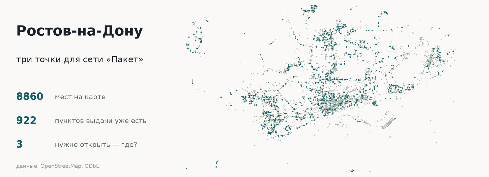

# Неделя 2. Инструменты: как дать агенту руки

22 сентября 2026.

## Лекция

Слайды: [L02.pdf](slides/L02.pdf). Про то, как модель научили звать инструменты, что гарантирует схема, почему описание инструмента — это интерфейс, и что из всей этой механики фреймворк берёт на себя.

## Практика: одиннадцать задач на OpenAI Agents SDK

Задачи независимы: застрял на одной — переходишь к следующей. Зачёт — шесть из десяти, нулевая разминочная не в счёт. Данные настоящие: 8860 мест Ростова из OpenStreetMap, из них 922 пункта выдачи заказов.

Что разбирается по задачам: первый агент и описания инструментов, цепочка из трёх вызовов, запрос объектом вместо плоских аргументов, замер описаний числом, память диалога, предохранитель и цена прогона, форма ответа, гардрейл, передача между агентами и сверка отчёта с базой.

**Как открыть.**

- В Google Colab: [открыть ноутбук](https://colab.research.google.com/github/myurushkin/ai_course_mmcs/blob/main/week2/practice/week02_agents.ipynb) и сразу «Файл» → «Сохранить копию на Диске».
- Локально: склонируйте репозиторий, поставьте зависимости из `practice/requirements.txt` и откройте `practice/week02_agents.ipynb` в VS Code или Jupyter.

**Что нужно до начала.** Ключ к сервису с моделью — от самой OpenAI или от посредника: сервис выбирается первой строкой во второй ячейке. Ключ вводится в поле и в сохранённый файл не попадает. AITunnel работает из России без VPN и оплачивается рублями; подойдёт любой OpenAI-совместимый сервис. Все задачи — порядка сорока пяти запросов на коротких промптах, то есть единицы рублей на недорогой модели.

Подробности про устройство практики — в [practice/README.md](practice/README.md).

## Задание 1

Срок — две недели. Условия и рубрика: [assignment.md](assignment.md).
